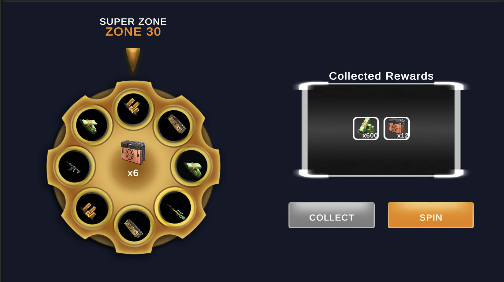
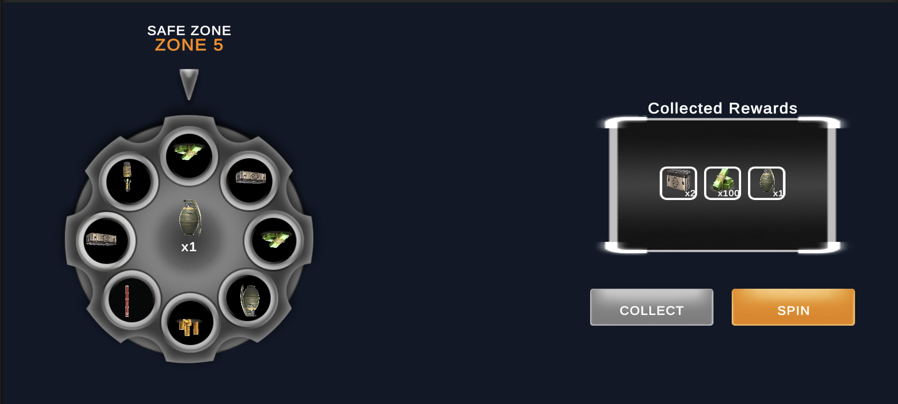
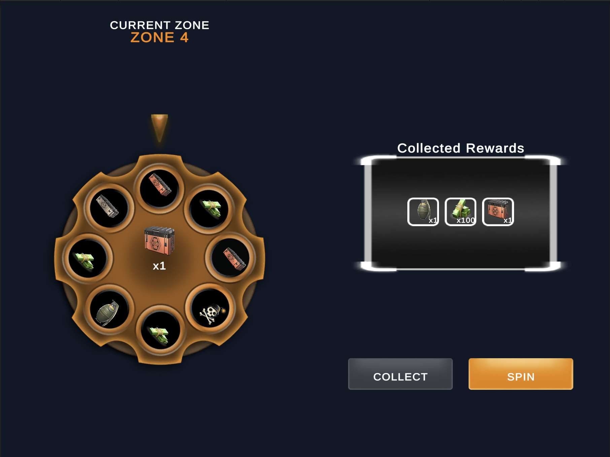

# Wheel Demo

A Unity-based wheel reward demo developed as a Game Developer assignment.

## Unity Version

Unity 2021.3.45f2

## Platform

- Android
- Landscape orientation
- Tested with 16:9, 20:9, and 4:3 aspect ratios

## Gameplay

The player spins a reward wheel and progresses through zones.

- Normal zones use the Bronze Wheel.
- Every 5th zone is a Safe Zone and uses the Silver Wheel.
- Every 30th zone is a Super Zone and uses the Golden Wheel.
- Bronze wheels may contain a bomb.
- Safe and Super wheels do not contain bombs.
- Rewards accumulate during the current run.
- Repeated rewards increase the amount of the existing reward entry.
- A bomb removes all uncollected rewards and ends the run.
- The player can collect and safely exit only in Safe and Super Zones.
- The player may continue when pass Zone 30.

## Controls

- **Spin:** Spins the active wheel.
- **Collect:** Secures accumulated rewards in Safe and Super Zones.
- **Restart:** Starts a new run from Zone 1 after collecting rewards or hitting a bomb.

## Wheel Types

### Bronze Wheel

Used in normal zones. Contains standard rewards and may contain a bomb.

### Silver Wheel

Used in Safe Zones. Contains improved rewards and does not contain bombs.

### Golden Wheel

Used in Super Zones. Contains high-tier rewards and does not contain bombs.

## Architecture

The project separates gameplay data, presentation, and game-flow responsibilities.

- `RewardData`: ScriptableObject containing reward identity, icon, type, and base amount.
- `WheelData`: ScriptableObject containing wheel visuals and slice configuration.
- `WheelSliceData`: Stores the reward and amount multiplier of an individual wheel slice.
- `WheelView`: Applies the selected wheel data to the scene UI.
- `WheelSliceView`: Displays reward data on an individual wheel slice.
- `WheelSpinController`: Handles random result selection and wheel animation.
- `GameFlowController`: Handles zone progression, bomb, collect, and restart flow.
- `RewardCollection`: Stores and combines rewards collected during the current run.
- `RewardPanelView`: Creates collected reward UI elements at runtime.
- `RewardItemView`: Displays an individual collected reward.
- `WheelResultView`: Displays the most recently earned reward in the center of the wheel.
- `RunResultPopupView`: Displays collect and bomb results.

## Responsive UI

- Reference resolution: `1920 x 1080`
- Canvas scaling mode: `Scale With Screen Size`
- Screen match mode: `Expand`
- Supported test ratios:
  - `16:9`
  - `20:9`
  - `4:3`
- Android orientation is restricted to landscape.

## Android Build

The installable Android APK is available from the repository's Releases section.

## Screenshots

### 16:9

### 20:9

### 4:3

